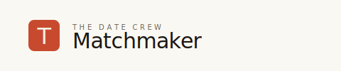

<p align="center">
  
</p>

<h3 align="center"><i>The substrate matchmaking pipelines grow on.</i></h3>

<p align="center">
  An editorial-grade workspace for The Date Crew.<br/>
  Built for the decision, not the profile.
</p>

<p align="center">
  
  
  
  
  
  
  
</p>

<p align="center">
  <a href="#quick-start">Quick Start</a> &nbsp;·&nbsp;
  <a href="#todays-brief">Today's Brief</a> &nbsp;·&nbsp;
  <a href="#case-files">Case Files</a> &nbsp;·&nbsp;
  <a href="#ai">AI</a> &nbsp;·&nbsp;
  <a href="#design-system">Design System</a> &nbsp;·&nbsp;
  <a href="#mobile">Mobile</a> &nbsp;·&nbsp;
  <a href="#stack">Stack</a>
</p>

---

## Quick Start

```bash
npm install
cp .env.example .env.local   # then add your API keys
npm run dev
```

**Demo login:** `priya.sharma` / `tdc2024`

Open <http://localhost:3000> — works on mobile and desktop, light & dark mode.

---

## Today's Brief

The dashboard is a **magazine front page**, not a CRM. The matchmaker opens it and sees:

1. **The date** (top-left) and a time-aware greeting (*Good morning, Priya.*)
2. **Three priority stats** — intros to send, follow-ups due, in-pipeline
3. **§ 01 Lead stories** — three featured cards ranked by *priority score* (stage urgency + days in stage + engagement), each with photo, name, age/city/job, stage blurb, and a one-sentence body. Top-right action: open case file.
4. **Yesterday digest** — new matches suggested, families replied, intros awaiting reply
5. **§ 02 The full pipeline** — every customer, filterable (Active / Stalled / All) and sortable (Urgency / Stage / Name)

The matchmaker glances, decides what to do in 5 seconds, and acts.

---

## Case Files

Click any customer → opens the **case file** in three columns:

- **Left rail** — the customer: photo, name, age/city/job, stage, full biodata, journey stepper
- **Center** — the compare canvas: the A/B score for the selected match, the four *key factors* that actually matter for this specific match (with concrete "Values — both non-vegetarian, both family-first" reasoning), the *other six dimensions* as a glance strip, matchmaker notes
- **Right rail** — the full match list with tier filters (All / Excellent / High / Good), keyboard navigation (`↑↓` to move, `⌘↵` to send)

Send match opens a **side-by-side composer**: dark reference panel on the left showing both people, light editor on the right with a structured email body. "Draft with AI" injects a one-sentence reason into the body (the rest of the email — salutation, intro sentence, reply instructions, sign-off — is hardcoded JSX, so the AI is doing one job well instead of rewriting everything).

---

## AI

Two providers, both optional, both with graceful fallback to deterministic scoring:

| Provider | Speed | Free tier | Used for |
|---|---|---|---|
| [Groq](https://console.groq.com) | ~0.5s | 1,000 req/day | Email body drafts |
| [OpenRouter](https://openrouter.ai) | ~2s | Pay-as-you-go | Match explanations, server-side scoring |

Add one or both to `.env.local`:

```env
NEXT_PUBLIC_GROQ_API_KEY=***
NEXT_PUBLIC_OPENROUTER_API_KEY=***
OPENROUTER_API_KEY=***      # server-side only, used by /api/match
```

**Three AI features:**

- **§ Enhance with AI** in the case file — generates per-match one-sentence explanations ("Aarav and Ananya share vegetarian values, both family-first, both Chandigarh-based, no relocation needed") via the server-side API route
- **Draft with AI** in the composer — generates a one-sentence reason and injects it into the email skeleton
- **Regenerate** — always hits the API for a fresh variant, ignoring any cached explanation

If no key is set, the UI degrades gracefully: explanations show the static fallback, the email composer shows the starter paragraph.

---

## Design System

- **Editorial brief** — Instrument Serif for headlines (like *The New Yorker* or a private banking letterhead), Inter for body, JetBrains Mono for numerics and metadata
- **Warm-neutral palette** — warm beige `#FAF8F3` (light) / warm off-black `#14110A` (dark), single ember terracotta accent `#C84A2E`
- **Subtle paper texture** — a fixed dot grid overlay on the body to evoke a printed page
- **Custom glyphs** — all icons are 1.25px stroke, sharp corners, no fills — drawn in-house to match the typography's voice (no Material Design, no filled icons)
- **Section numbers** — `§ 01`, `§ 02` like a magazine, with em-dash separators
- **Numbered hairlines** — drop caps, drop-cap initials, monospace metadata in eyebrow labels

The whole thing feels like *opening a magazine*, not opening a SaaS dashboard.

---

## Mobile

Designed mobile-first. Try opening it on a phone:

- The dashboard stacks: featured cards stack vertically, the search/filter row wraps, customer rows collapse from a 6-col table to a 2-row card (avatar+name+income+chevron on top, stage+city as a mono strip below)
- The case file: left rail collapses to a compact summary card (photo + name + 3 key facts), the right rail's match list becomes a horizontal scroll strip you swipe through
- The composer: dark reference panel stacks above the light editor on mobile
- The login page: editorial hero hides entirely, just the form

---

## Stack

| | |
|---|---|
| Framework | [Next.js 14](https://nextjs.org) (App Router) |
| Language | [TypeScript 5](https://www.typescriptlang.org) |
| Styling | [Tailwind CSS 3](https://tailwindcss.com) with CSS custom-property design tokens |
| Type | [Instrument Serif](https://fonts.google.com/specimen/Instrument+Serif) · [Inter](https://rsms.me/inter) · [JetBrains Mono](https://www.jetbrains.com/lp/mono) |
| Motion | [Framer Motion](https://www.framer.com/motion) |
| Icons | Custom 1.25px-stroke SVG glyphs (see `components/Glyph.tsx`) |
| AI | [Groq](https://groq.com) · [OpenRouter](https://openrouter.ai) |
| Hosting | [Vercel](https://vercel.com) |

---

## License

MIT
