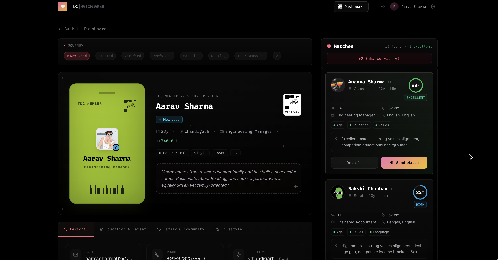
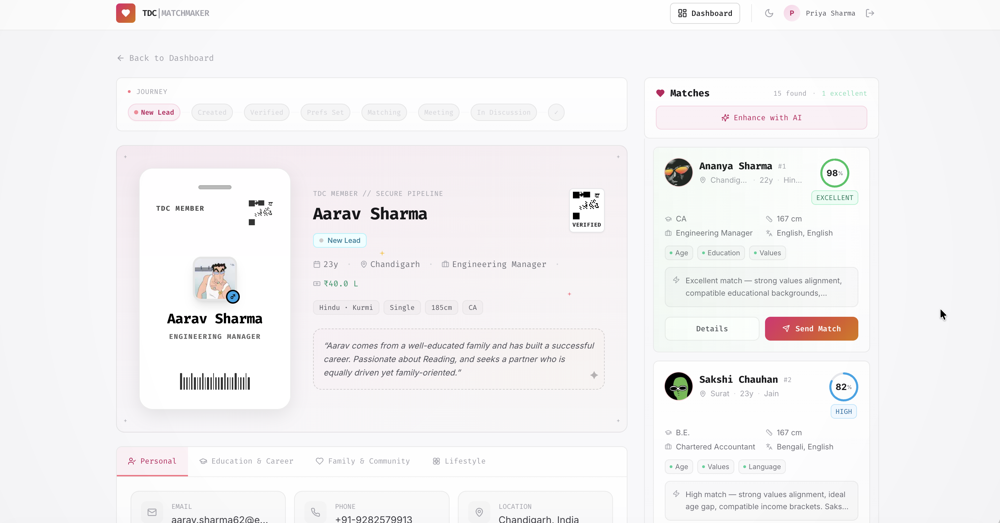

# TDC Matchmaker Assignment Submission

## Write-Up

**Tech Choices**

I built this with Next.js and TypeScript using the App Router. Tailwind handles all the styling through CSS variables that drive both dark and light modes. Framer Motion provides page transitions and animated score bars. Procedural sounds are handled through the Web Audio API for subtle feedback on theme toggle and button clicks. Profile data is generated from a seeded function so the output is deterministic but feels diverse. Auth is localStorage based since the MVP doesn't need a real backend.

**Matching Logic**

The engine scores every opposite gender profile on ten weighted dimensions. Values alignment carries the most weight, followed by lifestyle, education, age, income, religion and caste, height, language overlap, location, and family background. Scoring is gender specific. For male clients it weights younger age, lower income, shorter height, and matching views on children. For female clients it weights profession compatibility, shared values, and relocation flexibility. Each match produces a percentage score with a plain language explanation. A radar chart and score breakdown are available from any match card.

**AI Integration**

Groq serves as the primary AI provider with sub second responses. OpenRouter's free tier acts as a fallback if Groq is unavailable. Both call directly from the browser to avoid serverless timeout issues. The AI powers two features. First, the "Enhance with AI" button sends the top five matches to the LLM and maps the returned explanations onto the match cards. Second, a sparkle button inside the Send Match modal generates a personalized email intro for that specific match. If the match already has an AI explanation, it uses that as context. Otherwise it generates a compatibility note first, then writes the email from it. Generated emails are cached per match so reopening skips the API call. If the model returns unstructured text, a sentence extraction fallback pulls out relevant sentences by matching profile names against the raw output. If both providers fail entirely, the deterministic engine's explanations remain unchanged.

**Assumptions Made**

Static JSON was sufficient for the MVP profile pool. No database was needed since the focus is on the matching algorithm and the interface. Auth is mocked because the assignment asked for a login screen and gated dashboard rather than a full auth system. The dashboard is read heavy since matchmakers primarily scan and match profiles. Both dark and light themes are fully supported through CSS custom properties.

## How It Looks

  
  

## Submission Links

| Item | Link |
|------|------|
| **Live Site** | https://tdc-matchmaker-silk.vercel.app |
| **GitHub Repo** | https://github.com/srivtx/tdc-matchmaker |
| **Demo Login** | `priya.sharma` / `tdc2024` |
